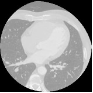
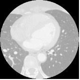
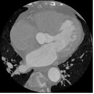

# Using generative models to create 3D medical images

Implementation
==============
Pytorch implmentation of a 3D-DDPM and 3DPGGAN
* DDPM model was able to outperform the 3DPGGAN by a few %
* Further optimization of the 3DPGGAN is needed to improve performance

Dataset
=======
* Dataset obtained as part of MMWHS consists of 20 labelled CT scans for training and 40 unlabelled CT scans for testing
* Images and labels are divided into folders called "/ct_train_images/" and "/ct_train_labels"
* Originally experimentation was not conditioned on labelled images

Sample Images
=============
* 2d axial slices obtained from 3D image at resolution of 128 x 128

</img>
</img>
</img>
</img>
